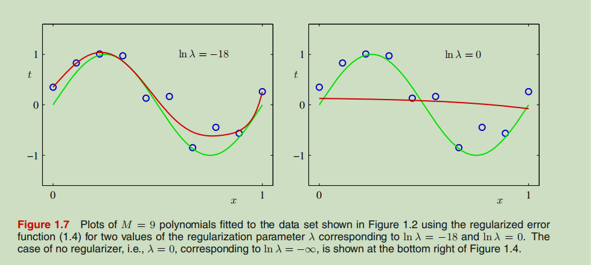

# 1.1 Example: Polynomial Curve Fitting

引入了一个简单的回归问题,贯穿这一章来介绍相关概念.

通过函数  生成10个样本,并在其中添加随机的噪声,这些样本作为观测值,将  对应的值作为希望预测的真实值.

实际上,我们需要通过数据去发现  这一函数

---

概率论及决策理论支持我们用更加精确和量化的方式去解决这一问题,将在后面介绍.

在一开始的例子中,先使用

这一多项式去拟合数据

---

上式虽然对于x而言是非线性的,但是对于其中的未知参数w,方程是线性的,称这类对未知参数是线性的模型为线性模型 _linaer model_

---

在利用多项式进行拟合的时候,通过最小化损失函数来实现 _error function_

方差一种简单的损失函数

式子中的1/2是为了方便之后的计算

---

我们可以通过最小化E(w)解决曲线的拟合问题, 这是由于损失函数是一个二元函数, 其中对于参数w的导数是线性的, 所以最小化损失函数这个问题有唯一解

---

在这个例子中,我们需要去选择多项式的阶

这个过程可以被称为模型比较或模型选择  _model comparison or model selection_

---

不同阶数的表现如上图所示, 图四这种现象称为过拟合 _over-fitting_, 函数过分学习了训练集, 曲线精确的穿过的每一个点, 表现出较大的抖动

---

考察模型的泛化能力, 按照构造训练集的方式构造新的数据集作为测试集, 在其中加入与训练集不同的随机噪声, 在测试集上也可以使用同样损失函数去评估模型的效果, 为了更加方便可以使用均方根
  _root-mean-square(RMS)_ 作为衡量的标准

式子中的除N可以让我们在不同规模的数据集上做出比较,开方可以让结果和目标t处于一个量级

---

上图为不同阶数的多项式在测试集和训练集上的性能表现.

阶数为9时,模型在测试集上的误差激增,这之前预期的结果是不同的,

1. 高阶的多项式包括了低阶多项式, 从这一角度看M=9的效果至少不应低于M=3时

2. 待拟合的函数sin, 可以展开成无穷高阶的多项式, 通过增大M应该能更好的逼近这一函数

---

再次观察模型, 随着阶数的增大, 模型中参数的数值也快速增大, 这也是曲线剧烈抖动的原因

---

增加训练集的大小也能观察到有趣的现象, 当M=9时,随着训练集中样本的增多, 模型的性能获得了更优的表现

---

One rough heuristic that is sometimes advocated is that the number of data points should be
no less than some multiple (say 5 or 10) of the number of adaptive parameters in
the model.

一种启发式的说法是模型的参数应当小于数据集的大小,但在之后讨论中可以发现这一说法并不合理

We shall see that the least squares approach to finding the model parameters 
represents a specific case of maximum likelihood (discussed in Section 1.2.5),
 and that the over-fitting problem can be understood as a general property of 
 maximum likelihood. By adopting a Bayesian approach, the Section 3.4
over-fitting problem can be avoided. We shall see that there is no difficulty 
from a Bayesian perspective in employing models for which the number of parameters
greatly exceeds the number of data points. Indeed, in a Bayesian model the effective 
number of parameters adapts automatically to the size of the data set.

通过最小二乘法来搜索模型参数是最大似然的一个特例, 而其表现出来的过拟合问题, 是最大似然方法的
一个一般性质

从贝叶斯的角度看, 参数数量并不受训练集大小的影响, 实际上有效的参数会随着训练集的规模自动调整

---

For the moment, 将继续讨论在有限规模的数据集上如何使用更复杂和灵活的模型

正则化是解决过拟合问题的常用方法 _regularization_

这一方法通过给损失函数增加一个惩罚项来避免参数过大,产生较大的抖动

常用的惩罚项形式如下:

Note that often the coefficient w0 is omitted from the regularizer because its
inclusion causes the results to depend on the choice of origin for the target variable
(Hastie et al., 2001), or it may be included but with its own regularization coefficient
(we shall discuss this topic in more detail in Section 5.5.1).

w0通常不会直接包含在正则项中,它会导致模型参数取决于初始目标变量的选择?

Again, the error function
in (1.4) can be minimized exactly in closed form. Techniques such as this are known Exercise 1.2
in the statistics literature as **shrinkage methods** because they reduce the value of the
coefficients. The particular case of a quadratic regularizer is called **ridge regression** (Hoerl and Kennard, 1970). In the context of neural networks, this approach is
known as **weight decay**.

这一方法,在统计学领域称为收缩法,在二元函数函数中进行调整时被称为岭回归, 在神经网络的语义里被称为权重衰减

---

in closed form 指利用有限的数据可以得到结果

---

适当的正则化能提升模型的性能,但过大的参数也会造成模型效果变差,从上图能够直观的感受到这种影响之剧烈

---

 In many cases, however, this will prove to be too wasteful of
valuable training data, and we have to seek more sophisticated approaches.

this指划分训练集和验证集
