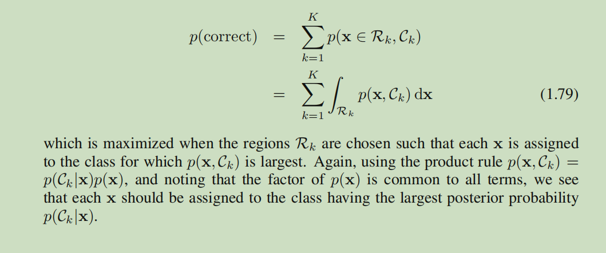
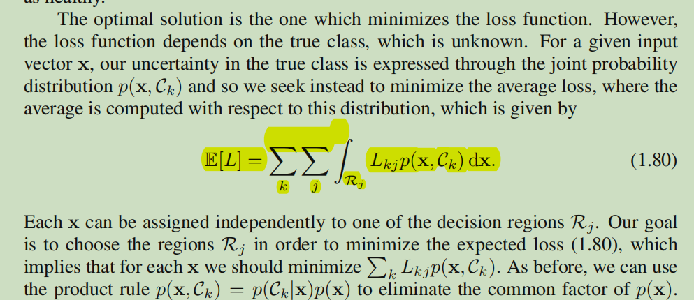
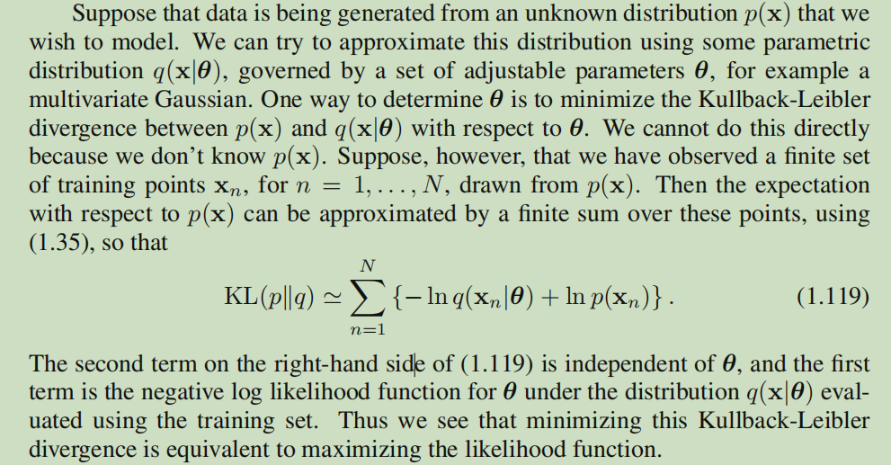

 #

 ## 1.4. The Curse of Dimensionality

  

  在分类任务中直接使用这种简单的分类方法会遇到许多问题，其中最严重的问题在于，当输入数据的维度很高时，划分出的区域数量将会指数型增长，就需要大量的数据保证每一个区域不为空

---

  Thus, in spaces
of high dimensionality, most of the volume of a sphere is concentrated in a thin shell
near the surface!

---

The severe difficulty that can arise in spaces of many dimensions is sometimes
called the curse of dimensionality

---

 First, real
data will often be confined to a region of the space having lower effective dimensionality, and in particular the directions over which important variations in the target
variables occur may be so confined. Second, real data will typically exhibit some
smoothness properties (at least locally) so that for the most part small changes in the
input variables will produce small changes in the target variables, and so we can exploit local interpolation-like techniques to allow us to make predictions of the target
variables for new values of the input variables.

首先,真正的数据通常会被限制在一个具有较低有效维度的空间区域，特别是决定目标中重要变化的方向的变量通常受限。其次，真实数据通常会显示出一些
平滑属性(至少在局部)，所以在大多数情况下输入变量的微小变化会引起目标值t的微小变化，因此我们可以借助插值类技术来对新输入的目标值进行预测。

## 1.5. Decision Theory

p(x,t)描述了输入和目标值之间不确定的联系，但在实际应用种我们通常需要一个准确的t值，或者根据对t值可能性的理解，采取一些行动，这方面就是决策论的内容

---

### 1.5.1 Minimizing the misclassification rate

_decision boundaries or decision surfaces_ 决策边界或决策平面

将输入空间进行划分，划分为不同的决策区域 _decision regions_ 每个区域对应不同的目标值，区域间的分界线称为决策边界或决策平面

---

关于决策，我们希望最大化正确分类的概率或者最小化错误分类的概率两种方式 经过推导都会得出要最大化后验概率这一结论

### 1.5.2 Minimizing the expected loss

在有些问题中不能简单的最小化错误概率，例如在癌症诊断的问题中，两种不同的错误代价是不同的，我们希望能减小某一种出现某一种错误的可能，即使是增加另一种错误的数量

---

### 1.5.3 The reject option

We have seen that classification errors arise from the regions of input space
where the largest of the posterior probabilities p(Ck|x) is significantly less than unity,
or equivalently where the joint distributions p(x, Ck) have comparable values. These
are the regions where we are relatively uncertain about class membership.

分类误差来源于具有如下特征的输入空间区域

 1. 最大的后验概率远小于一般情况
 2. 联合分布有相近的值

这些区域也是类别关系相对不确定的区域

---

In some
applications, it will be appropriate to avoid making decisions on the difficult cases
in anticipation of a lower error rate on those examples for which a classification decision is made. This is known as the reject option. For example, in our hypothetical
medical illustration, it may be appropriate to use an automatic system to classify
those X-ray images for which there is little doubt as to the correct class, while leaving a human expert to classify the more ambiguous cases. We can achieve this by
introducing a threshold θ and rejecting those inputs x for which the largest of the
posterior probabilities p(Ck|x) is less than or equal to θ.

在一些场景下对难以判别的问题放弃分类，交由专家处理，例如可以将后验概率过小的样本拒绝

### 1.5.4 Inference and decision

在之前的举例中分类问题被分成两个阶段，得到后验概率分布的inference阶段和进行分类的decision阶段，还有一种方法将这两个阶段合二为一，直接学习一个输入到决策的映射函数，这个函数被称为判别函数 _discriminant function_

---

Approaches that explicitly or implicitly model the distribution of
inputs as well as outputs are known as _generative models_ , because by sampling
from them it is possible to generate synthetic data points in the input space.

生成式模型

---

Approaches that model the posterior probabilities directly
are called _discriminative models_

条件判别模型

---

Find a function f(x), called a _discriminant function_, which maps each input x
directly onto a class label. For instance, in the case of two-class problems,
f(·) might be binary valued and such that f = 0 represents class C1 and f = 1
represents class C2. In this case, probabilities play no role.

判别模型

    Let's say you have input data x and you want to classify the data into labels y. A generative model learns the joint probability distribution p(x,y) and a discriminative model learns the conditional probability distribution p(y|x) – which you should read as 'the probability of y given x'.

---

_outlier detection or novelty detection_

生成式模型可以很好的简单的从数据中估计先验概率，同时允许通过边缘密度计算P(x)，这有助于检测在模型中概率较低，预测精度较差的新数据，这种技术称为异常值检测或新颖值检测

但如果我们仅仅是想做分类决策，生成式模型会浪费计算资源，并且对数据有着过高的要求

---

对于判别模型来说，不需要计算后验概率，但，在实际应用中有许多场景需要后验概率

Minimizing risk：当损失矩阵需要实时更新时（例如一些金融场景），判别模型需要不断使用训练数据进行更新，利用后验概率可以快速修改决策标准

Reject option：后验概率能够帮助制定拒绝标准

Compensating for class priors：考虑这样一种情况，正负样本严重失衡，为了训练的效果，对负样本进行下采样，我们需要一种方式去补偿/修正我们对训练数据分改动
   
Combining models：若两组数据条件独立，可以通过二者的后验概率快速的实现模型融合

### 1.5.5 Loss functions for regression

## Information Theory

我们该如何量化观察到变量某个特定值时所获得的信息量

The amount of information can be viewed as the ‘degree of surprise’ on learning the
value of x

信息的数量可以被看作学习到x值时候的意外程度

 If we are told that a highly improbable event has just occurred, we will
have received more information than if we were told that some very likely event
has just occurred, and if we knew that the event was certain to happen we would
receive no information.

---

The form of h(·) can be found by noting that if we have two events x
and y that are unrelated, then the information gain from observing both of them
should be the sum of the information gained from each of them separately, so that
h(x, y) = h(x) + h(y). Two unrelated events will be statistically independent and
so p(x, y) = p(x)p(y). From these two relationships, it is easily shown that h(x)
must be given by the logarithm of p(x)

衡量信息的函数是概率分布p(x)的单调函数，并且其形式是p(x)的log函数

---

h(x) = − log2 p(x)

Note that low
probability events x correspond to high information content

---

 _the entropy of the random variable x_

 随机变量的熵，即之前定义的量化信息的函数h(x)的期望

 ---

 This relation between entropy and shortest coding length is a general one. The
noiseless coding theorem (Shannon, 1948) states that the entropy is a lower bound
on the number of bits needed to transmit the state of a random variable.

熵与最短编码

---

---

值集中在几个峰附近的分布熵值较低，均匀分布具有更高的峰值

---

连续变量在高斯分布时能最大化熵

同样的，分布越平越宽熵越大，与离散熵不同的是，微分熵允许为负

---

### 1.6.1 Relative entropy and mutual information

KL散度，即相对熵，在计算形式上等于两个分布对应的熵的差值

其表达的含义为，真实的分布为p(x)，是未知的，我们使用一个分布q(x)去近似真实分布，当我们使用q(x)去构造一个编码方案，将x发送给另一方，比起用真实分布p(x)去构造编码并发送额外多出的信息

KL散度不具备对称性

---

A function f(x) is said to be convex if it has the property that
every chord lies on or above the function, as shown in Figure 1.31

二阶导处处为正

凸函数的定义 _convex functions_

注意与函数的凹凸性区分，再高数中函数的凹凸性指的函数图像的形状，与这里的凸函数的定义是相反的

 Convexity then implies

    f(λa + (1 − λ)b) <= λf(a) + (1 − λ)f(b)

---

与凸函数具有相反性质的函数，凹函数 _concave_

If a function f(x) is convex, then −f(x) will be concave.

f(x)为凸函数，则-f(x)为凹函数

---

_Jensen’s inequality_ 由凸函数的性质归纳得出

---

由Jensen’s inequality不等式可以推导出kl散度的上述性质

Thus we can interpret the Kullback-Leibler divergence as a measure of the dissimilarity of the two
distributions p(x) and q(x).

kl散度可以作为两个分布不相似程度的度量

---

数据压缩和分布估计之间有着密切的关系

---

通过最小化kl散度去估计分布

等效于最大化似然

---

kl散度还可以用来度量联合分布中的两个随机变量接近独立的程度

这种度量也被称为交互信息 _mutual information_

we can view the mutual information as the reduction in the uncertainty about x
by virtue of being told the value of y (or vice versa)

---

交互信息可以理解为在告知了y的真实值时，x不确定性的减小程度，反之亦然

 From a Bayesian perspective,
we can view p(x) as the prior distribution for x and p(x|y) as the posterior distribution after we have observed new data y. The mutual information therefore represents
the reduction in uncertainty about x as a consequence of the new observation y
